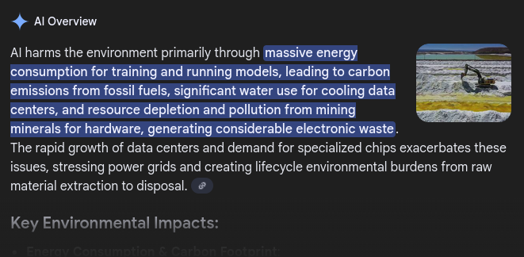

# How To Start Programming Without Gen AI

***Published: 29-12-2025***

Learning is not as hard as you recall.

## Why does Gen AI suck?
*Gen AI refers to one form of AI, I do not hate the entire concept of AI.*

I'm sure in the big '26 I don't need to explain the many reasons why AI is awful, but I will anyway.
1. It drinks more water than Denmark.

According to the United Nations, "Globally, AI-related infrastructure may soon consume six times more water than Denmark, a country of 6 million [...]" [(source)](https://www.unep.org/news-and-stories/story/ai-has-environmental-problem-heres-what-world-can-do-about)

2. Its making you dumber.

If you are finding it difficult to find where to start learning a new skill, it might be sign you are affected. In fact, you may of 'programmed' a few apps or websites yourself and have no real
memory of how to create one from scratch without the aid of Gen AI.

"While AI can make tasks faster and feel easier for students, some studies have found the use of this technology can lead to putting less effort into their learning; poorer critical thinking, problem solving and even collaboration skills; producing lower-quality reasoning and argumentation than their peers who use traditional search engines." [(source)](https://www.smf.co.uk/publications/ai-and-learning/)

If you check out that source you may be quick to point out the fact that students did actually have very little negative effects when Gen AI was applied properly, but before you go 
jumping into use it I ask you to consider the other points in this list.

3. It steals.

Gen AI cannot create, only generate. Understanding the difference between these two things might not come easy and the discussion to be had around it is major. Suffice to say, AI can not at this
moment in time - or for the forseeable future - create anything original, everything is derivative.

Now, this on its own is not a bad thing. The issue comes from what sources AI generates from. If you are using any major Gen AI tool (such as ChatGPT) then you are actively using a service that has
taken training data from people not willing to give up that data - people wish to protect their own original work and AI companies ignore them. When you generate something with AI that isn't the
AI's work, that's a combination of many stolen humans work.

4. You get the point

I could list off other reasons why Gen AI sucks balls but these points alone should make you not want to use it.

## It's normal to feel like you know nothing

Everything you know today started from nothing. You had no knowledge of anything and here you are with knowledge of something - the wonders of the human brain.

In the case of programming, I'm willing to bet you already know something. Programming pulls from many skills you've built up, much like anything else you might want to learn.

A lot of people will suggest you go learn HTML (not a programming language) and then go on to mix in some JavaScript to understand the basics of programming. You can for sure do this and it's the way many people start. But if you want to try something a litter harder I would suggest learning python. Python is incredibly beginner friendly and very versitile which once learnt can be used to learn other languages such as Java or C#. Note that the jump between these languages can be steep to begin with but at their core all programming languages act in a similar way.

At the end of the day you got to this webpage, which means you know how to operate a personal computer. If you can do that there's already some skills deep within your noggin that you can apply to learning programming.

## Learning Resources

My number one learning resource has been higher education, but going to college is hardly your only option. I've utalised many useful sources that have been vital in my learning:

- [W3Schools](https://www.w3schools.com/)

You will never learn anything too complex from W3Schools but they will give you the basics for many languages and frameworks for free, a great starting point.

*Also, don't buy any certifications from them. It's a waste of money.*

- [FreeCodeCamp](https://www.freecodecamp.org/)

I have never really used FreeCodeCamp that much but I've heard good things. As the name suggests, it's free. You will get to learn more complex topics from certain languages but its a smaller range of tutorials than W3 offers.

But hey; Jack of all trades, master of none.

- [Youtube](https://www.youtube.com/)

There's this hip new website all the kids are raving about and its "YouTube".

This one goes without saying, type in a programming language in the search bar and slap "tutorial" on the end of it. Hundreds of thousands of hours worth of programming tutorials all for the price of free... if you can stomach the adverts.

*Maybe get an adblock if you don't have one already.*

- [StackOverflow](https://stackoverflow.com/questions)

If you ever get stuck on something you might be tempted to rush back to AI to explain the issue, don't. If ever you are stuck just google your issue and I assure you there will be an existing and solved StackOverflow post giving you the solution, the difference here is that you learn how to fix the issue for yourself instead of getting a garbled mess of copyright theft to do it for you.

***- Made with love***